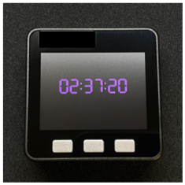

# M5Stack-Clock

Displays the time obtained from the NTP server on the M5Stack core.



## Usage

Add SSID and password to get the time from the NTP server.

```
const char* ssid = "yourSSID";
const char* password = "yourPASSWORD";
```